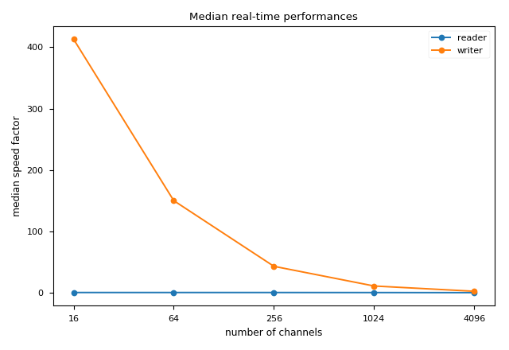

In this sub-benchmark, we analyse the real-time performances of
different sub-networks.

The outputs of this sub-benchmark should look like those inside
the [`outputs`](outputs/) directory (i.e. expected outputs). For
example, in the case of a network composed of a `reader` and a `writer`,
the main output is:

To execute this benchmark use the following instructions:

1. Change your current working directory  
`cd ~/circusort/benchmarks/scaling/electrodes`
1. Launch IPython  
`$ ipython`
2. Launch  
`In[1]: %run main.py`

You can alternatively use one of the following instructions for step 2.:

- Launch the generation only  
`In[2]: %run main.py --generation`
- Launch the sorting only *(generation must have been executed once
before)*  
`In[3]: %run main.py --sorting`
- Launch the introspection only *(generation and sorting must have been
executed once before)*  
`In[4]: %run main.py --introspection`
